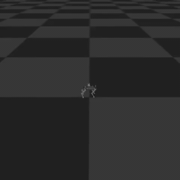
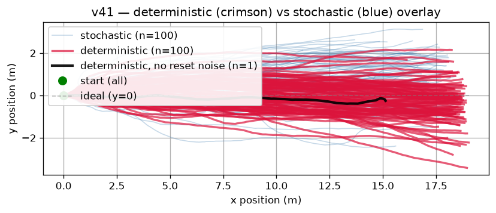
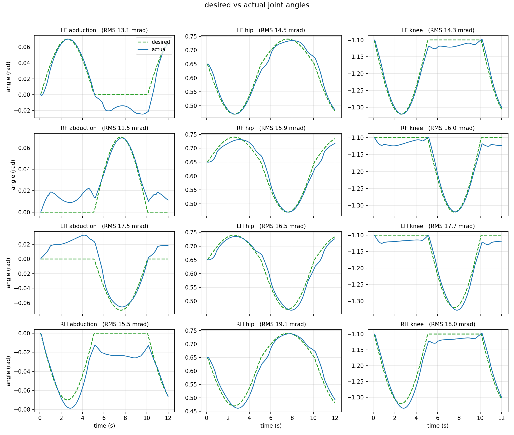
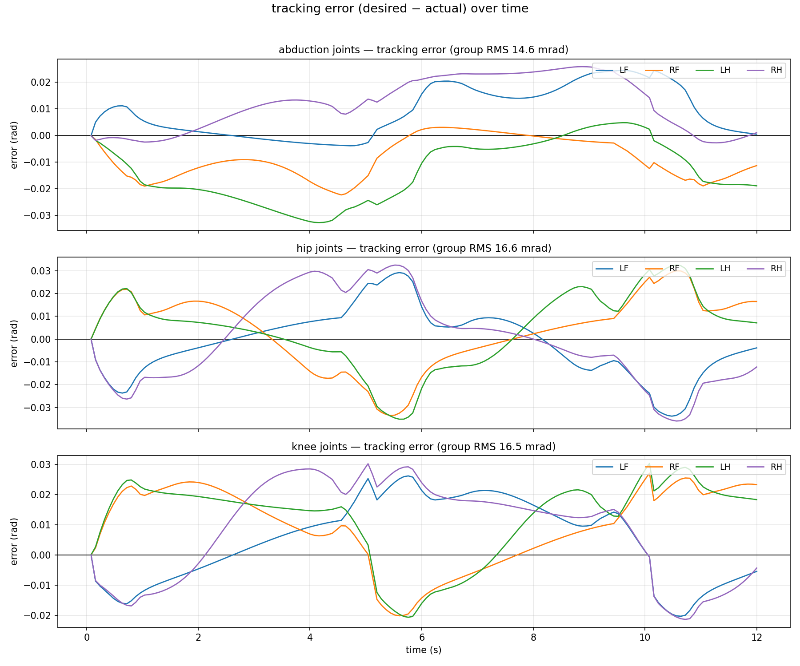

# MISTI 2026 — Quadruped Controller Comparison

Controller comparison study on a 12-DOF quadruped (XGO Dogzilla S2) in MuJoCo.
Goal: implement and benchmark PID, MPC, and PPO on standard dog locomotion.

## Status
| Controller | Status |
|------------|--------|
| PID        | Done: ~16 mrad RMSE avg across joints |
| MPC        | In progress |
| PPO        | Done: v41 walks ~18 m in a 1000-step episode (n=100 deterministic), 97% survival; eval in `controllers/ppo/ppo_eval/` |

## Scope

The MuJoCo plant models and their parameters were provided by a graduate student in the
lab and, apart from the addition of sensors mimicing the onboard IMU, are unmodified. The contribution in this repo is the controllers themselves and the scripts used to evaluate them.

**Contributions.** This was a two-person project:

- **PPO** is Nico's — the learning environment, reward design, training, and evaluation.
- **MPC** is James's — the control loop and logic (in a separate repo, not yet merged here).
- **PID** was a collaboration — Nico wrote the PID class (`pid.py`) and the run/log/plot
  scripts; James wrote the control loop and logic.

## Results

**PPO (v41) rollout** — learned position policy, deterministic no-reset-noise episode in MuJoCo:



Trajectory spread across 100 deterministic episodes (reset-noise fan-out):



Distance 18.04 m ± 2.11 (deterministic), survival 0.97; 16.13 m / 0.84 stochastic. Full
numbers in [`controllers/ppo/ppo_eval/v41/metrics.json`](controllers/ppo/ppo_eval/v41/metrics.json);
cross-version comparison in [`summary.csv`](controllers/ppo/ppo_eval/summary.csv). Honest
limitation: the gait is a bounding/gallop, not a clean trot — energy shaping fixed foot-drag
but pushed toward a ballistic bound; gait quality is the next target (AMP).

**PID** — joint-setpoint tracking on the torque plant (`controler-v1.xml`):

| tracking | error |
|----------|-------|
|  |  |

~16 mrad RMSE across joints (per-joint 11.5–19.1).

## Directory

```
dogzilla-control/
├── controllers/
│   ├── pid/
│   │   ├── pid.py              # PID controller class (P/I/D + anti-windup + feedforward)
│   │   ├── Testpid.py          # run the PID gait in the MuJoCo viewer
│   │   ├── log_pid_run.py      # run headless, log joint/desired/error arrays -> run_log.npz
│   │   ├── plot_pid_log.py     # plot tracking + error from the logged run
│   │   └── controler-v1.xml    # MuJoCo model for PID (torque / <motor> actuators)
│   ├── mpc/
│   │   └── mpc.py              # MPC controller: separate repo, not yet merged (stub)
│   └── ppo/
│       ├── dogzilla_env.py     # custom Gymnasium env (12-DOF DOGZILLA S2 / XGO)
│       ├── ppo_training.py     # train PPO from scratch (SB3)
│       ├── ppo_warmstart.py    # continue / fine-tune training from a saved version
│       ├── ppo_watch.py        # watch a trained policy in the MuJoCo viewer
│       ├── ppo_log.py          # dual-mode eval -> metrics.json, trajectory.png, video
│       ├── ppo_controller.py   # wrap a trained policy as controller(command, obs) -> (12)
│       ├── stand_test.py       # no-policy plant sanity check (holds the stand keyframe)
│       ├── ppo-progress-log.md # per-version training + reward-shaping log
│       ├── assets/             # ppo_dog.xml (position actuators) + XGO mesh STLs
│       ├── models/             # saved model weights (*.zip; only published v41 committed)
│       ├── ppo_eval/           # summary.csv + published v41 metrics.json & trajectory plots
│       └── tb_logs/            # TensorBoard training logs (gitignored)
├── envs/
│   ├── Prueba2_19_03.xml       # Original MuJoCo File - from advisor
│   ├── assets/XGO/             # XGO mesh STLs
│   ├── hardware.yaml           # physical robot spec (stub)
│   └── chameleon/              # separate CAD deliverable — do not touch
├── notes/                      # controller theory + MuJoCo reference notes
├── benchmark/
│   └── benchmark.py            # task-level benchmark harness (pending MPC — stub)
├── results/                    # PID run log (run_log.npz) + tracking/error plots
├── requirements.txt
└── README.md
```

## Quick start

```bash
# PID — run a tracking episode, then plot it
python controllers/pid/log_pid_run.py      # -> run_log.npz
python controllers/pid/plot_pid_log.py     # -> tracking.png, error.png

# PPO — reproduce the best policy's eval (weights committed: v41)
python controllers/ppo/ppo_log.py 41 --episodes 100   # committed metrics are n=100; default is 10
mjpython controllers/ppo/ppo_watch.py 41       # live viewer (macOS: mjpython, else python)

# PPO — train from scratch / fine-tune (optional)
python controllers/ppo/ppo_training.py <version> [--steps N] [--envs K]
python controllers/ppo/ppo_warmstart.py <from_version> <to_version> [--steps N] [--envs K]
```
